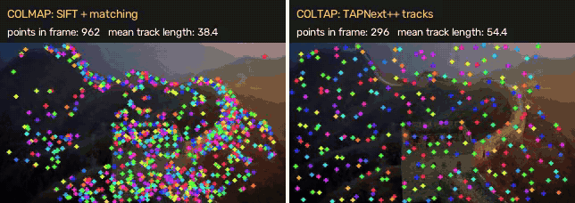

# COLTAP — COLMAP with TAPNext++ point tracking

COLTAP replaces COLMAP's correspondence search (SIFT feature extraction +
pairwise matching) with **dense, long-term point tracks from DeepMind's
[TAPNext++](https://tap-next-plus-plus.github.io/)** for ordered image
sequences (videos, walk-throughs). The tracks are written into a **standard
COLMAP database**, so COLMAP's mapper and every downstream module (bundle
adjustment, undistortion, PatchMatch MVS, model converters, Gaussian-splatting
/ NeRF tools that read COLMAP models) run unchanged.



*Left: tracks of COLMAP's 3D points (SIFT + sequential matching). Right: tracks
of COLTAP's 3D points (TAPNext++). Same frames, same COLMAP mapper. More:
[`assets/`](assets/) (Colosseum, synthetic scene with ground truth, fox).*

## How it plugs into COLMAP

COLMAP has no separate "tracking" step: a track is the connected component of
pairwise, geometrically verified feature matches. COLTAP produces the same
database tables directly from TAPNext++ tracks:

```
 stock COLMAP                                COLTAP
 feature_extractor  ─┐                        ┌─ coltap feature_tracker
 sequential_matcher ─┴─► database.db ◄────────┘   (TAPNext++ + COLMAP's own
                          │                         geometric verification)
                          ▼
     mapper / bundle_adjuster / image_undistorter / patch_match_stereo / ...
                          ▼
             sparse/0/{cameras,images,points3D}.bin   (unchanged format)
```

| stock COLMAP | COLTAP equivalent |
|---|---|
| `colmap feature_extractor` + `colmap sequential_matcher` | `coltap feature_tracker` |
| `colmap automatic_reconstructor` | `coltap automatic_reconstructor` (`--tracker tapnext` or `sift`) |
| `colmap mapper` | `coltap mapper` (COLMAP's mapper via pycolmap) |
| any other command (`image_undistorter`, `patch_match_stereo`, `model_converter`, ...) | `coltap <command>` forwards verbatim to the `colmap` binary |

Options keep COLMAP's `--Section.option value` syntax
(`--ImageReader.camera_model`, `--ImageReader.mask_path`,
`--SequentialMatching.overlap`, `--TwoViewGeometry.max_error`,
`--Mapper.*`, ...). COLTAP adds `--TapTracker.*`, `--TrackSelection.*` and
`--GapBridge.*` (see `coltap feature_tracker --help`).

## Install

```bash
pip install -e ./coltap            # pulls pycolmap, torch, opencv, ...
# optional, for MP4/GIF rendering:
pip install -e "./coltap[viz]"
```

The TAPNext++ checkpoint (Apache-2.0) is downloaded on first use to
`~/.cache/coltap` (2.5 GB download, slimmed to 0.8 GB). Set
`COLTAP_CACHE_DIR` to change the location, or pass
`--TapTracker.checkpoint`.

## Quick start

```bash
# Video in, COLMAP model out (sparse/0 in COLMAP's binary format).
coltap automatic_reconstructor \
    --video_path clip.mp4 --VideoReader.stride 3 \
    --image_path ws/images --workspace_path ws

# Or step by step, exactly like COLMAP:
coltap feature_tracker --image_path ws/images --database_path ws/database.db \
    --tracks_path ws/tracks.npz
coltap mapper --image_path ws/images --database_path ws/database.db \
    --output_path ws/sparse
colmap image_undistorter ...      # unchanged COLMAP from here on

# Side-by-side tracking video (COLMAP model vs COLTAP model).
coltap compare_tracking --image_path ws/images \
    --colmap_path ws_sift/sparse/0 --coltap_path ws/sparse/0 \
    --output_path compare.mp4 compare.gif
```

On a CPU without a GPU use `--TapTracker.precision bf16` if the CPU supports
it (AVX512-BF16/AMX: ~2x faster, median 2D error 0.36 → 0.41 px on our
synthetic benchmark). On CUDA, fp16 is used automatically.

## Which points are used: the selection weight

Every observation and track gets a score; only confident, static tracks
reach the database (`coltap/database.py`):

| stage | rule | option |
|---|---|---|
| observation | confidence = P(visible) × localization certainty (TAPNext++ heads) ≥ 0.5 | `--TrackSelection.min_confidence` |
| track | ≥ 3 confident observations | `--TrackSelection.min_track_length` |
| track | **static score** = fraction of verified image pairs in which the track is an inlier of COLMAP's two-view geometry ≥ 0.5 | `--TrackSelection.min_static_score` |
| ranking | weight = mean confidence × static score (used with a per-image cap) | `--TrackSelection.max_tracks_per_image` |

Points on independently moving objects violate the epipolar geometry of the
static background and get a low static score. Controlled test
(`tests/test_database.py`): 400 static + 80 independently moving points over
16 frames → mean static score 0.99 vs 0.36; 396/400 static tracks kept,
61/80 moving tracks rejected. The 19 that survive move slowly or along their
epipolar lines, which a two-view test cannot see (see Limitations).

Masks in COLMAP's format (`--ImageReader.mask_path`, black = ignore) are
honoured both for query placement and for every tracked
observation — the hook for stage-2 semantic masks (people, cars, cloth).

Query points are Shi-Tomasi corners placed one per free cell of a coarse
grid; a new tracker instance is started when live coverage drops (new
content, occlusions). At most 3 instances run at once; when the cap is hit
the oldest instance is retired and its confident points are handed off to the
new one under the same track id, which yields long tracks at bounded cost.

## Results (stage 1: static scenes)

All runs: CPU only (4 cores, bf16), pycolmap 4.2.1, single shared camera
(`SIMPLE_RADIAL`), sequential pairing (overlap 10 + quadratic) for both
pipelines, unmodified COLMAP incremental mapper. Reproduce with
[`benchmark/compare.py`](benchmark/compare.py).

### Synthetic static scene with exact ground truth (48 frames, 640×480)

Ray-traced textured room with occluding boxes (`benchmark/make_synthetic.py`).

| metric | COLMAP (SIFT) | COLTAP (TAPNext++) |
|---|---:|---:|
| registered images | 48 / 48 | 48 / 48 |
| 3D points | 9792 | 1166 |
| mean track length (frames) | 14.1 | **25.0** |
| mean reprojection error (px) | 0.218 | 0.242 |
| ATE (% of trajectory extent) | 0.040 | 0.040 |
| relative rotation error, mean / max (°) | 0.024 / 0.062 | **0.022 / 0.053** |

TAPNext++ 2D accuracy against ground truth: median error **0.41 px**, 91.8 %
of observations within 1 px, 99.0 % within 2 px; 99.8 % of observations
reported visible are truly visible.

### Real static videos

| scene | method | registered | 3D points | track length | reproj. error (px) | time (s) corr. + mapping |
|---|---|---:|---:|---:|---:|---:|
| Great Wall drone, 96 frames 640×360 | COLMAP | 96/96 | 5744 | 20.8 | **0.40** | 13 + 46 |
| | COLTAP | 96/96 | 960 | **41.2** | 0.51 | 270 + 21 |
| Colosseum drone, 114 frames 640×360 | COLMAP | 114/114 | 8996 | 44.5 | 0.38 | 40 + 177 |
| | COLTAP | 114/114 | 473 | **95.8** | **0.36** | 223 + 32 |

No ground truth for these clips; the two independent reconstructions agree
within 0.30 % (Great Wall) / 0.50 % (Colosseum) of the trajectory extent and
0.29° / 0.12° mean relative rotation.

### Where COLTAP is weaker: discontinuous captures

The instant-ngp *fox* set (50 hand-picked frames, 540×960, large jumps
including an 18-frame gap and a fast roll) is not a continuous video. Scored
against the instant-ngp reference poses (themselves produced by COLMAP-SIFT):

| method | registered | track length | reproj. error | ATE (% extent) | RRE mean / max (°) |
|---|---:|---:|---:|---:|---:|
| COLMAP | 50/50 | 6.2 | **0.54** | **0.26** | **0.29 / 0.83** |
| COLTAP | 50/50 | 5.9 | 0.75 | 1.06 | 0.61 / 2.83 |

Without the SIFT gap bridge (below) COLTAP registered only 31/50 images.

## Limitations (read before using)

* **Ordered input only.** TAP models track through time. Unordered photo
  collections should use `--tracker sift` (stock COLMAP).
* **Gap bridge.** Where consecutive frames share < 30 tracks (cut, dropped
  frames), SIFT matches are added in a window around the break and on the
  long-range pairs crossing it (`--GapBridge.*`, on by default). It never
  triggered on the smooth sequences above.
* **Fewer, longer tracks.** ~400–600 points per frame (`--TapTracker.grid_cells`
  controls density) versus 1–3k for SIFT. Pose accuracy was on par on smooth
  video, worse on the jumpy fox set.
* **Speed.** TAPNext++ (ViT-B, ~1 s/frame/instance on 4 CPU cores in bf16) is
  much slower than SIFT on CPU; the mapper is 2–6× faster on COLTAP's compact
  tracks. GPU timing has not been measured here.
* **No descriptors in the database.** The mapper and later stages do not need
  them; registering *new* images later with vocabulary-tree matching does.
* **Static score = two-view epipolar test.** Motion along epipolar lines or
  very slow motion is not detected; stage 2 adds masks / motion segmentation.

## Package layout

| module | role |
|---|---|
| `coltap/third_party/tapnext/` | vendored TAPNext/TAPNext++ PyTorch model (Apache-2.0, unmodified apart from imports) |
| `coltap/model.py` | checkpoint handling, preprocessing, one online step with visibility/certainty |
| `coltap/queries.py` | coverage grid and query seeding |
| `coltap/tracking.py` | multi-instance online tracking with handoff, optional backward pass |
| `coltap/database.py` | selection weights, COLMAP database writer, verification |
| `coltap/bridge.py` | SIFT gap bridge for broken track graphs |
| `coltap/pipeline.py`, `coltap/cli.py` | pipelines and the `coltap` command line |
| `coltap/visualize.py`, `coltap/evaluate.py`, `coltap/synthetic.py` | demos, metrics, synthetic ground truth |

Tests: `cd coltap && pytest` (no network weights needed).

## Credits and licenses

* TAPNext / TAPNext++: Google DeepMind, Apache-2.0
  ([tapnet](https://github.com/google-deepmind/tapnet), commit `730cda1`).
  Zholus et al., *TAPNext: Tracking Any Point (TAP) as Next Token
  Prediction*, 2025; Jung et al., *TAPNext++*, CVPR 2026 Findings.
* Demo clips are derived from third-party sample data: Great Wall and
  Colosseum videos from the [VGGT](https://github.com/facebookresearch/vggt)
  examples, the fox images from
  [instant-ngp](https://github.com/NVlabs/instant-ngp). Check their terms
  before redistributing the clips in `assets/`.
* COLTAP code: BSD-3-Clause, like COLMAP.
